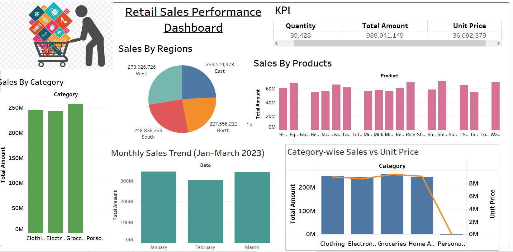

# 📊 Retail Sales Performance Dashboard

## 📌 Project Overview  
This project analyzes **retail sales performance** using **SQL, Python, and Tableau**.  
The goal is to understand sales trends, regional performance, and product/category-level insights, and to present them in an interactive dashboard.  

---

## 🛠️ Tools & Technologies  
- **Python** → Data cleaning, preprocessing, and exploratory analysis  
- **SQL (PostgreSQL)** → Data storage, querying, and aggregation  
- **Tableau** → Data visualization and dashboard creation  

---

## 📂 Dataset  
The dataset contains retail sales transactions with fields such as:  
- **Order Date**  
- **Region**  
- **Category**  
- **Product**  
- **Units Sold**  
- **Total Amount**  

---

## 📊 Key Insights  
1. **Sales by Region** → Compare sales across North, South, East, and West regions  
2. **Sales by Category** → Identify which product categories (Clothing, Electronics, Groceries, etc.) perform best  
3. **Sales by Products** → Analyze top-performing and underperforming products  
4. **Sales Trend Over Time** → Track growth and seasonality patterns  

---

## 📈 Dashboard Features  
- Interactive filters for **Year, Region, and Category**  
- Visuals used: **Pie Charts, Bar Charts, Line Charts**  
- Custom **background image** to enhance storytelling  
- Easy-to-read **sales KPIs**  

---
## Dashboard image

## 🚀 How to Run  
1. Import the dataset into **PostgreSQL** and run SQL queries for cleaning and summarization  
2. Use **Python (Pandas, Matplotlib/Seaborn)** for additional analysis if required  
3. Load the processed dataset into **Tableau Public/Desktop**  
4. Build dashboards with charts and filters    

---

## 🔮 Future Improvements  
- Add **forecasting models** (using Python ML) to predict future sales  
- Create **drill-down dashboards** with customer-level analysis  
- Automate data pipeline (ETL) for real-time reporting  

 

